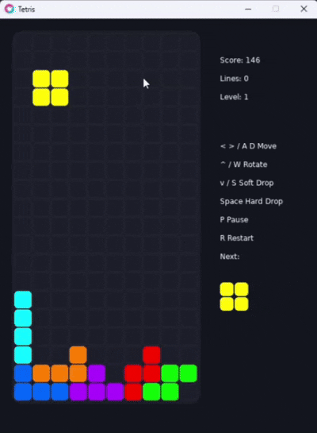

# Love Tetris

A clean, colorful Tetris game built with [LOVE / Love2D](https://love2d.org/) and Lua.

This project is intentionally small and approachable: classic falling-block gameplay split into a few focused Lua modules, with enough structure for beginners to read, tweak, and contribute without fighting a big codebase.

## Preview



Love Tetris includes:

- Classic 10 x 20 Tetris board
- Seven tetromino pieces: I, O, T, S, Z, J, and L
- Randomized 7-bag piece generation
- Next-piece preview
- Soft drop and hard drop
- Score, line, and level tracking
- Increasing speed as levels rise
- Pause, resume, and restart controls
- Game over screen with quick restart

## Requirements

- [LOVE / Love2D 11.x](https://love2d.org/) or newer
- Git, if you want to clone and contribute

## Getting Started

Clone the repository:

```bash
git clone https://github.com/jhzrmx/love-tetris.git
cd love-tetris
```

Run the game with Love2D:

```bash
love .
```

On Windows, you can also drag the project folder onto `love.exe`.

## Controls

| Key | Action |
| --- | --- |
| Left Arrow / A | Move piece left |
| Right Arrow / D | Move piece right |
| Up Arrow / W | Rotate piece |
| Down Arrow / S | Soft drop |
| Space | Hard drop |
| P | Pause or resume |
| R | Restart the game |

Movement, rotation, and soft drop keys can be held down for repeated input.

## Scoring

The game uses level-based line clear scoring:

| Lines Cleared | Points |
| --- | --- |
| 1 | 100 x level |
| 2 | 300 x level |
| 3 | 500 x level |
| 4 | 800 x level |

Soft drops add `1` point per row. Hard drops add `2` points per row.

## Project Structure

```text
love-tetris/
  ├── board.lua
  ├── config.lua
  ├── main.lua
  ├── pieces.lua
  ├── ui.lua
  ├── LICENSE
  ├── preview.gif
  └── README.md
```

The game is split into small modules so contributors can work on focused parts of the codebase:

- `main.lua` wires the Love2D callbacks and game flow together.
- `board.lua` manages board state, collision checks, locking pieces, and line clearing.
- `pieces.lua` contains tetromino data, rotation, and 7-bag generation.
- `ui.lua` draws the board, active piece, sidebar, preview, and game-over overlay.
- `config.lua` stores shared constants for layout, colors, scoring, and timing.

## Ideas for Contributors

Here are some friendly ways to improve the game:

- Add ghost piece preview
- Add hold piece support
- Add sound effects and background music
- Add start menu and settings screen
- Add high score saving
- Improve wall kicks during rotation
- Add animations for line clears
- Add mobile or gamepad controls

## Contributing

Contributions are welcome.

To contribute:

1. Fork the repository.
2. Create a new branch:

   ```bash
   git checkout -b feature/your-feature-name
   ```

3. Make your changes.
4. Test the game with:

   ```bash
   love .
   ```

5. Commit your work:

   ```bash
   git commit -m "Add your feature"
   ```

6. Open a pull request.

Please keep changes focused and easy to review. If you are planning a larger change, opening an issue first is a great way to discuss the direction.

## Development Notes

- Keep gameplay behavior simple and predictable.
- Prefer readable Lua over clever Lua.
- Avoid adding large dependencies unless they clearly improve the project.
- Test controls and game-over restart before opening a pull request.

## License

This project is licensed under the MIT License. See [LICENSE](LICENSE) for details.
